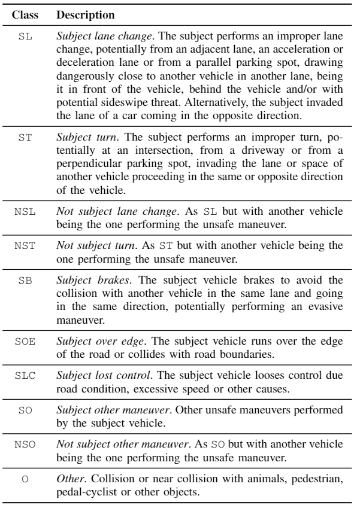
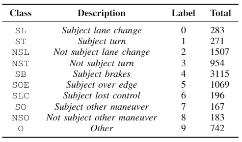

# SHRP2 NDS Unsafe Maneuver Annotations

This repository contains a set of annotations on top of SHRP2 NDS dataset that address the concern of identifying the maneuver that lead to the dangerous situdation (also referred as *unsafe maneuver*).  

To get access to the dataset, please refer to the  [SHRP2 NDS website](https://www.shrp2nds.us/index.html).

### Annotations overview

The SHRP2 dataset is a collection of more that 8800 safety-critical events, gathered by more than 3300 drivers between 2010 and 2013.
Such events are manually annotated with event-, driver- and environment-related variables, for a total of 75 labels.  

In particular, each safety-critical event in the dataset has been labeled with the **start and the end** of the event and the so-called **precipitating event**, *i.e.*, *"The state of environment or action that began the event sequence under analysis"*, answering the question *"but for this action, would the crash or near-crash have occurred?"*.
for a total of 64 different annotations.  

By using these annotations as our starting point, we define a set of classes, by aggregating similar SHRP2 annotations and by manually relabelling the ones not falling perfectly into a category, as described in below.  



### Annotations Details

The precipitating event label has been grouped, starting from SHRP2 NDS precipitating event, as described below.
Each class is formed by the safety-critical events with the specified precipitating event.


#### Subject lane change

```
Subject lane change - left, sideswipe threat
Subject lane change - right, sideswipe threat
Subject lane change - left behind vehicle
Subject lane change - right behind vehicle
Subject lane change - right in front of vehicle
Subject lane change - left in front of vehicle
```

#### Subject turn

```
Subject in intersection - turning left
Subject in intersection - turning right
Subject making a U-turn
```

#### Not subject lane change

```
Other vehicle lane change - left in front of subject
Other vehicle lane change - right in front of subject
Other vehicle lane change - left, sideswipe threat
Other vehicle lane change - right, sideswipe threat
Other vehicle from entrance to limited access highway
```

#### Not subject turn

```
Other vehicle entering intersection - turning same direction
Other vehicle entering intersection - turning onto opposite direction
Other vehicle entering intersection - left turn across path
Other vehicle entering intersection - right turn across path
Other vehicle - making U-turn
Other vehicle from driveway - turning into same direction
Other vehicle from driveway - turning into opposite direction
```

#### Subject brakes

```
Other vehicle ahead - decelerating
Other vehicle ahead - slowed and stopped 2 seconds or less
Other vehicle ahead - stopped on roadway more than 2 seconds
Other vehicle ahead - at a slower constant speed
```

#### Subject over edge

```
Subject over right edge of road
Subject over left edge of road
```

#### Subject lost control

```
This vehicle lost control - excessive speed
This vehicle lost control - other cause
This vehicle lost control - poor road conditions
```

#### Subject other

```
Subject vehicle backing
Subject in intersection - passing through
```

#### Not subject other

```
Subject vehicle ahead - decelerating
Subject vehicle ahead - slowed and stopped 2 seconds or less
Subject vehicle ahead - stopped on roadway more than 2 seconds
Subject vehicle ahead - at a slower constant speed
Other event not attributed to subject vehicle
```

#### Other

```
Animal in roadway
Pedestrian in roadway
Pedalcyclist/other non-motorist in roadway
Object in roadway
Animal approaching roadway
Pedestrian approaching roadway
Pedalcyclist/other non-motorist approaching roadway
Object approaching roadway
```

#### Manual review

The following precipitating events, not falling directly in one of the aforementioned classes or potentially ambiguos, has been manually reviewed and relabeled:

```
Subject over left lane line
Subject over right lane line
Subject lane change - right, other
Subject lane change - left, other
Subject vehicle, other
Subject vehicle - end departure
Other vehicle lane change - left other
Other vehicle lane change - right other
Other vehicle lane change - left behind the subject
Other vehicle lane change - right behind the subject
Other vehicle from parallel/diagonal parking lane
Other vehicle entering intersection - straight across path
Other vehicle from driveway - straight across path
Other vehicle oncoming - over left line
Other vehicle - backing
Other vehicle - traveling in opposite direction
Other vehicle - other
This vehicle lost control - unknown cause
```

As a results, we obtained a dataset with the following annotations:  



### Other dataset details

The vast majority of SHRP2 NDS videos have a duration of 30 seconds and are acquired at 15 *fps*, thus, made of 450 frames. 
However, due the naturalistic type of the acquisition, some videos are shorter (when the event occur immediately after the camera was turned on, for instance) and some other longer, due, for instance, different cameras settings or malfucntions. 
Moreover, some cameras are displaying camera information as an overlay on screen for the first seconds after being turned on, that may lead a machine learning model to overfitting.

For this reason, we preprocessed each video by eventually removing some frames at the beginning of the video and/or at the end so that 


- they have a length of 450 frames top 
- all camera information frames has been removed
- the event fully contained with some margin in the cropped video

while removing the videos not satisfying this constraints.
This is specified in the dataset anntotation file by the variables `VideoStart` and `VideoEnd`
Also, we cropped the GPS/IMU data accordingly.

### Reference

If you find this dataset useful, please cite this paper:
```
@article{simoncini2020,
  title={Two-stream neural architecture for unsafe maneuvers classification from dashcam videos and GPS/IMU sensors},
  author={Simoncini, Matteo and Coimbra de Andrade, Douglas and Salti, Samuele and Taccari, Leonardo and Schoen, Fabio and Sambo, Francesco},
  journal={TBD},
  year={TBD}
}
```
